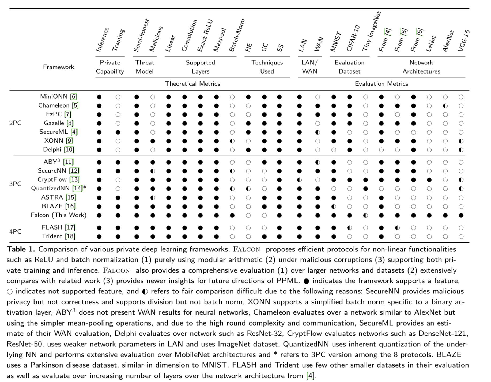
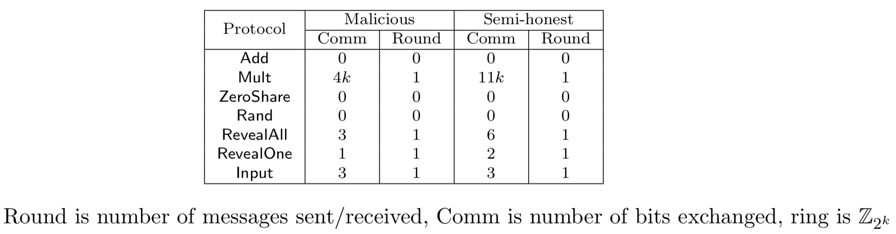

#### [Falcon论文](File:///Users/kunliu/Desktop/z_mlpaper/[2020] Falcon- Honest-majority maliciously secure framework for private deep learning.pdf)阅读（PET2020 CCF C类）
###### 一、基本框架
​        本文设计了一个三方安全计算的机器学习框架。三方主要包括数据拥有者(data holder, DH)，需要机器学习服务的查询用户(query users, Users)和提供机器学习服务的计算服务器(computing servers, Server). Falcon框架包括两个阶段：训练阶段和推导阶段。训练阶段由DH提供数据，Server计算出机器学习模型；推导阶段User向Server发出查询请求，Server提供一个训练模型。DH把数据用重秘密共享(Replicated secret sharing)方式把数据分布到不同3个服务器上。三个服务器利用这些共享数据训练出各自不同神经网络模块，用户此时可以提交查询，并得到模型的秘密分块。用户通过重构这些秘密分块重构出完整的训练模型。这种方式的优点是，因为服务器只有秘密分块，因此DH的数据对三个服务器都是完全隐私的，Users的查询请求也对服务器也是保密的。   
​     Falcon使用安全多方计算设计协议。安全性满足恶意安全，如果一方是恶意腐败的(corruption)，协议能够保证有正确的输出或者终止协议的恶意行为，不会输出错误的结果。同时文章也是[开源的](https://github.com/snwagh/falcon-public.git)。同时文章也对不同的机器学习安全多方计算协议进行比较，如下图。

###### 二、技术

* 秘密共享

  一个秘密$x \in \mathbb{Z}_{2^k}$随机抽样成$x_1, x_2, x_3 \in \mathbb{Z}_{2^k}$，并且有$x = x_1+x_2+x_3$，秘密分块分布成三个部分$\{(x_1, x_2),(x_2, x_3),(x_1, x_3)\}$，每个拥有者$i$都持有第$i$th部分。因此秘密共享可以表示成$[\![x]\!]^{\mathsf{A}}$作为一个三元组$(x_1, x_2, x_3)$​​，每一方都拥有一对秘密共享。可以观察到三方中的任意两方能够恢复出秘密$x$​​​，意味着这个方案最多只能容忍一方是恶意的。在秘密共享中每个算子的消耗是如下：

  

  第$i$方把他的秘密对$x_i$发送给第$i+1$方，通过三个秘密分块相加，每一方都能够在本地重构恢复出$x$​。同样的，第$i-1$方发送$x_{i-1}$​给

